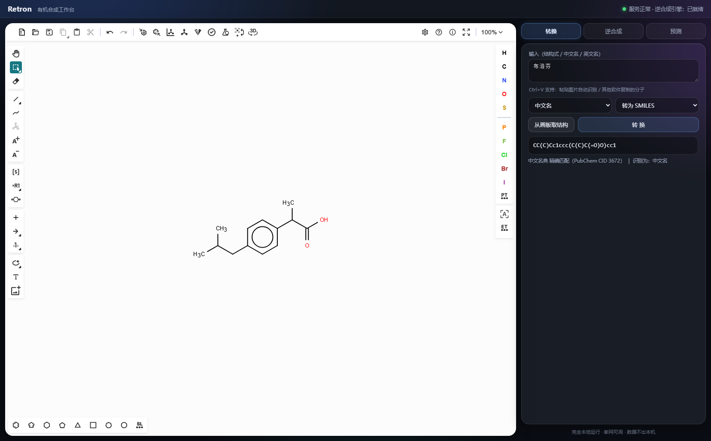
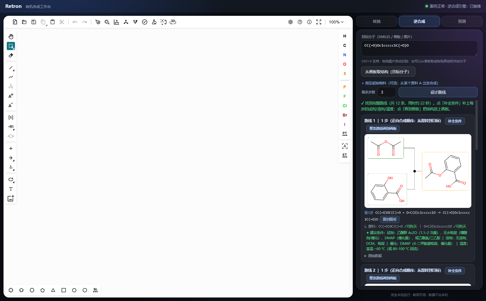
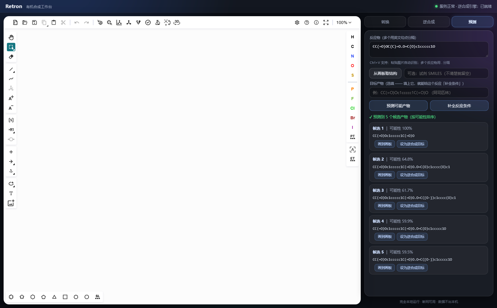

# Retron · 有机合成工作台

**一个完全离线运行的有机合成桌面工具。**

画结构式、做结构/名称互转、倒推合成路线、补全反应条件、预测反应产物 —— 全部在你自己的电脑上完成。

**断网可用 · 数据不出本机 · 永久免费**

[English](README.md) | [简体中文](README.zh-CN.md)



---

## 为什么做这个

做有机合成时经常要开一堆在线工具：画结构的、查名字的、算分子式的、设计路线的 —— 大多数要么收费订阅，要么要求把结构上传到别人的服务器。

Retron 把这些事情全都搬到本机：装上就能用，拔掉网线照样跑，画的结构、查的分子、设计的路线**一个字节都不会离开你的电脑**。

---

## 功能

### 画板

完整的化学结构编辑器（Ketcher，已中文化），画分子、画反应式。**把结构式截图直接粘到画板上**，会自动识别成可编辑的结构。

### 结构 ⇄ 名称互转

输入 `布洛芬` / `ibuprofen` / `CC(C)Cc1ccc(C(C)C(=O)O)cc1` 中任意一种，返回另外几种（含分子式、InChI）。

内置词典覆盖 **约 20 万个化合物、320 多万条别名**（商品名、THF / DMSO 这类缩写、CAS 号都有），所以日常叫法就能查，不必写规范名。


### 逆合成路线设计

给一个目标分子，得到多条倒推路线，按**正向合成顺序**排列（第 1 步 = 最先做的反应），每步标注原料是否可购买。

也支持"从指定原料出发"：手里已经有 A，想设计成目标 B 的路线。



### 反应条件补全

每一步都能补上建议的**试剂、溶剂、催化剂、温度** —— 来自 68 万条文献先例 + 命名反应规则。

路线可以逐步或整条画到画板上对照，**已画的内容不会被清掉**。

### 正向反应预测

给反应物（可选填试剂），预测最可能生成的产物，按可能性排序。候选产物可一键画到画板或设为逆合成目标。



### 图片识别结构

把论文或其他化学软件里的结构式截图粘进来，自动识别成可编辑的结构（MolScribe 主力，DECIMER 兜底）。其他软件复制的 MOL 文本同样支持。

---

## 技术架构

```
Electron 桌面外壳
   └─ 后台静默拉起本地服务（127.0.0.1:8765，无命令行窗口）
         ├─ 转换引擎   RDKit + 自建词典 + OPSIN
         ├─ 逆合成引擎 AiZynthFinder（MCTS 搜索）
         ├─ 识图引擎   MolScribe / DECIMER
         ├─ 正向预测   ReactionT5v2
         └─ 条件推荐   DRFP 反应指纹 + 文献先例检索
```

五个引擎运行在**五套独立的 Python 环境**里 —— 它们的依赖互相冲突（不同版本的 PyTorch / TensorFlow / OpenNMT），装在一起会装不通；分开还有个好处：某个引擎出问题不影响其他功能。

界面和引擎通过本机回环地址通信，不经过网络。关掉窗口即完全退出，不留后台进程。

---

## 获取完整版

完整的离线版本约 **11 GB**（化合物库、词典、四个 AI 模型、五套运行环境），**不放在本仓库里** —— 那些是上游的大体积二进制文件。

如何从本仓库的源码装配出可运行版本，见 [`docs/BUILD.md`](docs/BUILD.md)。

**运行要求**：Windows 10 / 11（64 位）。**不需要**预先安装 Python、Java 或任何运行库，也不需要管理员权限。

> 换到别的电脑：把**整个文件夹**复制过去，双击 `Retron\Retron.exe`。首次启动会自动修复环境路径、创建桌面快捷方式，之后全程离线运行。

---

## 仓库结构

```
app/                 本地服务：接口路由 + 引擎进程管理
engine/              五个引擎
  chemistry/         结构 / 名称 / 分子式互转
  retro/             逆合成路线搜索
  vision/            图片识别结构
  forward/           正向反应预测
  conditions/        反应条件推荐
web/                 界面（三标签页）与画板
shell/               Electron 桌面外壳
tools/               维护脚本 + 五套环境的依赖清单
  repair_env.py            换电脑/换位置后自动修复环境路径
  check_runtime_deps.py    运行环境依赖体检
  make_dist.py             生成可分发版本
  requirements/            五套环境的依赖快照
docs/                截图与构建说明
```

---

## 用到的开源项目

没有这些项目就没有 Retron：

| 组件 | 用途 | 许可证 |
|---|---|---|
| [Ketcher](https://github.com/epam/ketcher) | 化学结构编辑器 | Apache-2.0 |
| [RDKit](https://www.rdkit.org/) | 化学信息学工具包 | BSD-3-Clause |
| [AiZynthFinder](https://github.com/MolecularAI/aizynthfinder) | 逆合成搜索 | MIT |
| [OPSIN](https://github.com/dan2097/opsin) | 系统命名解析 | MIT |
| [MolScribe](https://github.com/thomas0809/MolScribe) | 结构识别 | MIT |
| [DECIMER](https://github.com/Kohulan/DECIMER-Image_Transformer) | 结构识别 | MIT |
| [ReactionT5v2](https://huggingface.co/sagawa/ReactionT5v2-forward-USPTO_MIT) | 反应预测 | MIT |
| [Electron](https://www.electronjs.org/) | 桌面外壳 | MIT |

数据来源：AiZynthFinder 的 Zinc 可购买化合物库（1742 万条）、USPTO_Condition（68 万条先例）、PubChem / Wikidata / 药品目录（词典）。

---

## 已知限制

- **仅支持 Windows**。引擎本身是跨平台的 Python，但桌面外壳与路径自愈逻辑按 Windows 编写。
- **逆合成首次运行较慢**（加载化合物库与模型约 1 分钟），之后每次约 20 秒。
- **图片识别**对印刷体准确率高；手绘草稿、复杂立体构型可能需要人工核对。
- 路线与产物预测是**基于文献数据的建议**，实际可行性请以实验为准。

---

## 许可证

[MIT](LICENSE)。第三方组件遵循各自许可证（见上表）。
